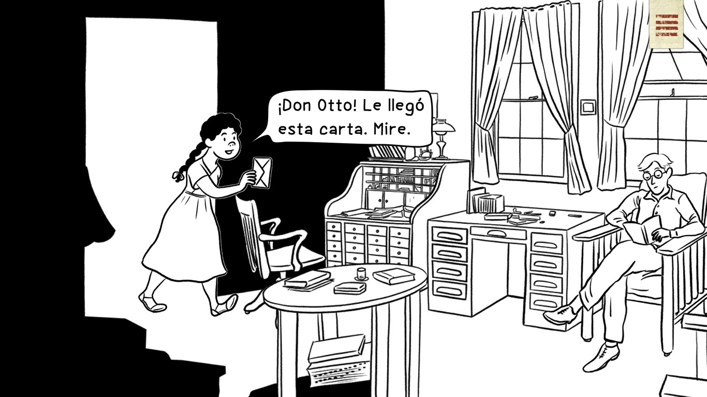

<!DOCTYPE html>
<html manifest="index.hyperesources/cache.manifest">
  <head>
	<meta http-equiv="Content-Type" content="text/html; charset=utf-8" />
	<meta http-equiv="X-UA-Compatible" content="chrome=1,IE=edge" />
	<title>El viaje de Otto</title>
	
	<!-- copy these lines to your document head: -->

	<meta name="viewport" content="user-scalable=yes, width=1366" />
	
	
	
	
	

	<!-- end copy -->
  </head>
  <body>
	<!-- copy these lines to your document: -->

	

		<noscript>
			
		</noscript>
		
	

	<!-- end copy -->
	

	<!-- text content for search engines: -->

	

		
El vapor Junín continua su curso a través del río Magdalena, con una tripulación animada. El alemán Otto, el alto y delgado Antonio y la mulata Josefa componían un grupo extraño que despertaba el interés en marineros y viajantes. Josefa, como pez en el agua, se codeaba con el despensero, y los cocineros, echaba chistes y supervisaba los platos de Otto en la cocina, mientras que Antonio sufría al verla atravesar proa y cubierta sin miramientos ni vergüenza.

		
Capítulo 4

		
LA DORADA

		
PUERTO NARE

		
EPÍLOGO

		
INICIO

		
MOMPOX

		
HONDA

		
BARRANQUILLA

		
AMBALEMA

		
Este libro fue posible gracias a:

		
El viaje de Otto es una historia creada por Andrea Sazu y Andrezzinho.
Música original de Carlos Dudley Sandoval.

		
¡JA!

		
En ruta hacia Mompox, Bolívar.

		
!

		
Los marineros dijeron que en el río Nare encontraremos a los pescadores. Además dicen que el agua  es brillante y claritica.

		
A él no le gustan esa clase de pescados. Solo lo he visto comer nicuro.

		
Por dios santo, Josefa

		
¿hmmm?

		

		
¡Vamos a comer pescado en el pueblo!
Los marineros dicen que es riquísimo

		
Pues… don Otto ha estado escribiendo y me dijo que volviera en la tarde, entonces creo que sí nos da tiempo.

		
Depronto se antojaba
de comer con nosotros
un viudo de capaz, ¡o un bocachico!

		
¿No invitaste al señor Otto?

		
¡Antonio!

		
Yo aprendí a comer bocachico con mi hermano mayor.
¡Nosotros desayunábamos con pescado!

		
Podría ser un solo día… o varios, dependiendo de las lluvias.

		
Respetados tripulantes, 
tenemos un impase.

		
¡SU ATENCIÓN, POR FAVOR!

		
Nuestro personal a bordo, se encargará de 
orientarlos mientras el nivel del agua sube unos metros.

		
Hemos encallado.

		
Vapor Junín, Puerto Conejo, La Dorada.

		
Los invito, por ahora, a disfrutar de la población de Puerto Nare.

		
No puede ser...

		
¡Estos vapores ya no sirven para nada!

		
¡Oh!

		
Exploraré un poco la zona. No veo que sea peligroso ir sin la compañía de Antonio.

		
…una de las cosas más notables del Magdalena es la abundancia de caimanes; podría hacerse una explotación fructuosa con su piel, y hasta con el marfil de sus dientes...

		
Vaya. Interesante apunte… el doctor Saffray definitivamente tenía buen ojo para observar las posibilidades comerciales en la región. Sería interesante descubrir a los mencionados caimanes. 

		
Josefa y Antonio dejaron atrás el vapor Junín, mientras que
Otto Schmidt observaba al río: guacamayas y manatíes se
escondían en sus aguas mientras la tarde iba pasando.

		
Una culebra lo mordió mientras caminaba

		
¡¡¡¡¡SEÑOR OTTO!!!!!!!

		
¿Va a estar bien?

		
Pues…
estamos esperando
al curandero.

		
¿Qué le pasó al señor?

	

	<!-- end text content: -->

  </body>
</html>
